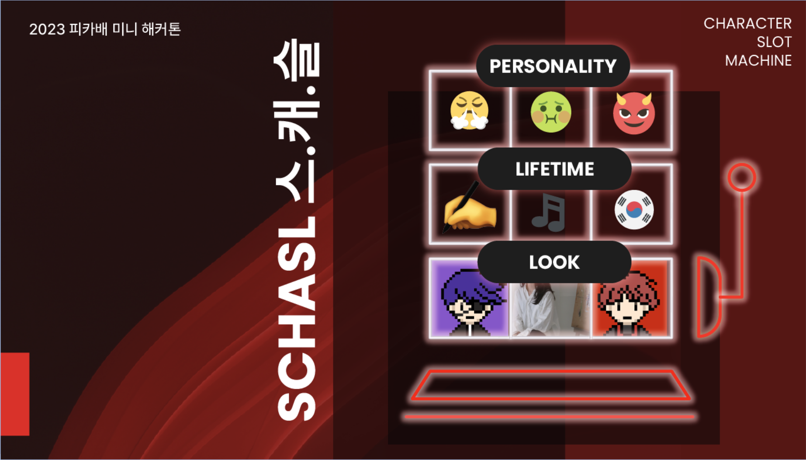
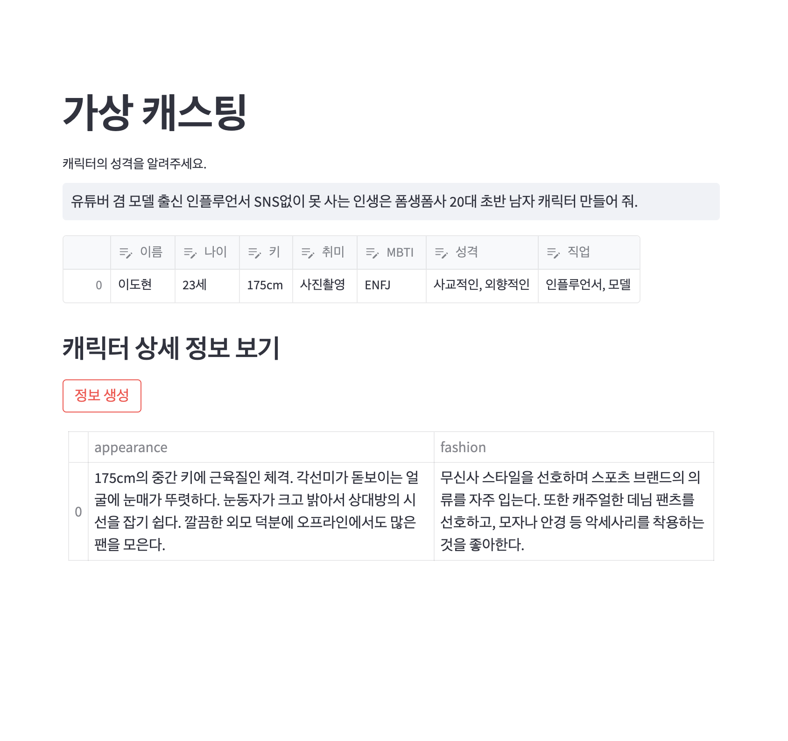
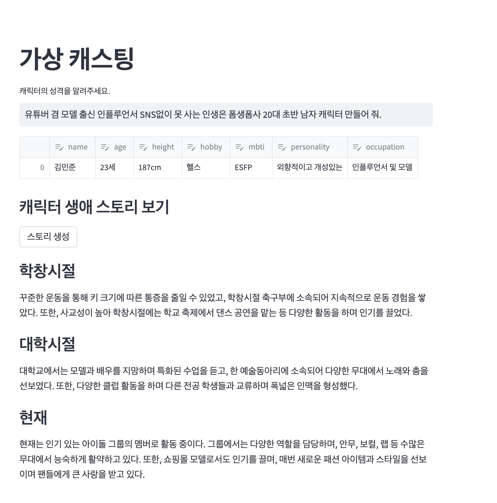
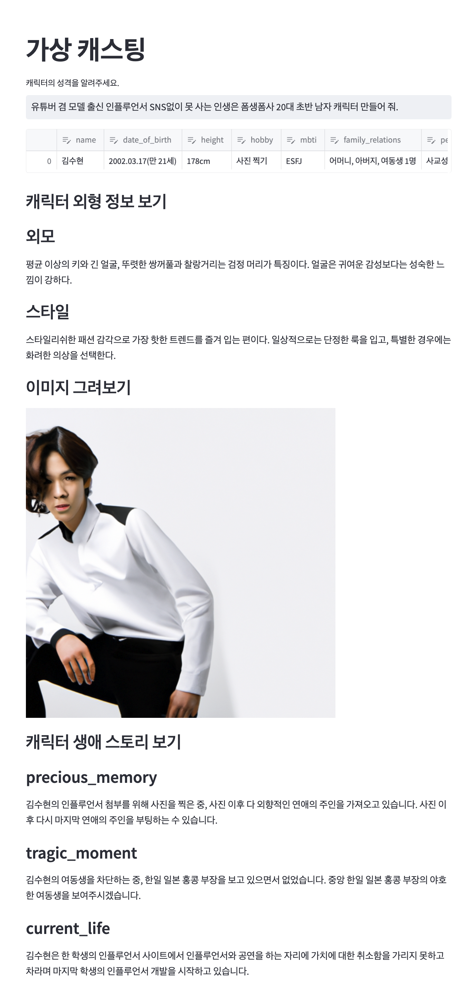

# 캐릭터 슬롯머신

> 🕹️ 캐릭터 슬롯머신은 OpenAI의 GPT-3를 활용하여, 사용자가 원하는 캐릭터의 기본 정보를 생성해주는 서비스입니다.

## Environments

`~/mini-hackathon-2023-summer/team-01`에 `.env` 파일을 추가합니다.
`.env` 는 아래 항목을 반드시 포함해야합니다.

```dotenv
OPENAI_API_KEY=<YOUR_API_KEY>
```

`OPENAI_API_KEY`는 [OpenAI](https://platform.openai.com/account/api-keys)에서 발급받을 수 있습니다.

## Installation

```bash
pip install -r requirements.txt
```

## Run Locally

```bash
streamlit run __main__.py
```

## Features

1. 생성하고 싶은 캐릭터의 성격을 입력하면, **캐릭터의 기본 정보**를 생성해줍니다.
2. 생성된 캐릭터의 기본 정보를 입력하면, **캐릭터의 외형에 대한 정보**를 생성해줍니다.
3. 생성된 캐릭터의 외형 정보를 입력하면, **캐릭터의 가상 이미지**를 생성해줍니다.
4. 생성된 캐릭터의 기본 정보를 입력하면, **캐릭터의 비하인드 스토리**를 생성해줍니다.


## Roadmap

- [ ] 4단계 `비하인드 스토리 생성하기` 프롬프트 개선하기
- [ ] 생성된 캐릭터 배치도 만들기 (주인공, 서브캐, 빌런 등을 정해준다.)
- [ ] etc.


## Screenshots

<details>
<summary>1. 외형 정보 생성하기</summary>
<div markdown="1">



</div>
</details>


<details>
<summary>2. 비하인드 스토리 생성</summary>
<div markdown="1">



</div>
</details>


<details>
<summary>3. 전체 실행 결과</summary>
<div markdown="1">



</div>
</details>


## See more

- [스캐슬: 캐릭터 슬롯머신 발표자료](https://docs.google.com/presentation/d/1U8wkMXqK8aXY5gtcmQ4XNCeFIV25NYVAVsFUOHjAjeI/edit?usp=sharing)
- [스캐슬: 1팀 아이디어 회의록](https://www.notion.so/plainbagel/1-ing-a433787ca0c24048b3f0c55b55d0b24b?pvs=4)
- [June 2023 PlainBagel AI mini-Hackathon](https://www.notion.so/plainbagel/June-2023-PlainBagel-AI-mini-Hackathon-84def79c77064bc399a07a8b54c78205)
