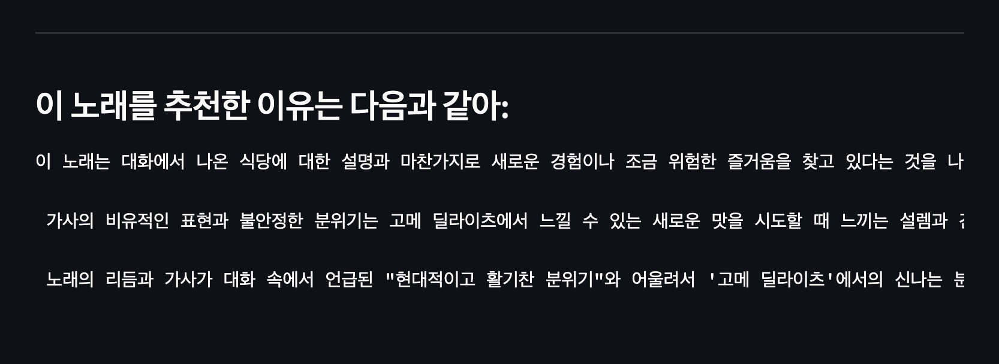
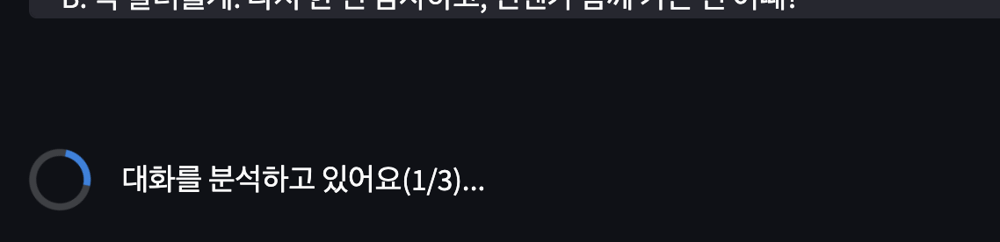
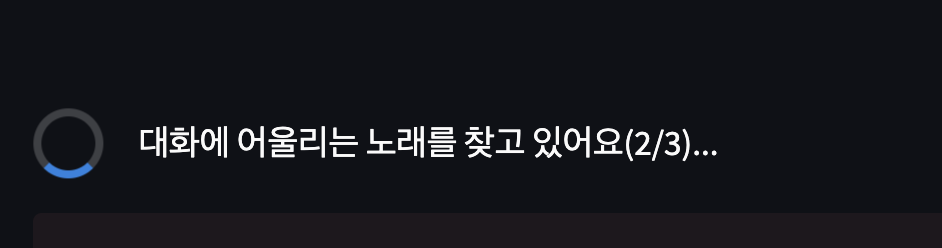
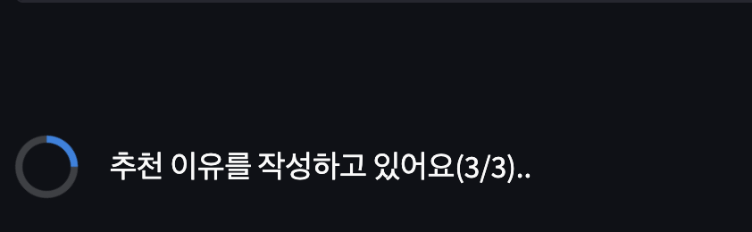

# 챗껄룩 ‍🐈‍⬛

> 🎶 챗껄룩팀은 OpenAI의 [Chat Completion API](https://platform.openai.com/docs/guides/gpt/chat-completions-api)와
> [Embeddings API](https://platform.openai.com/docs/guides/embeddings/what-are-embeddings)를 활용하여,
> 주어진 대화에 어울리는 노래를 추천해주는 서비스를 만들었습니다.

## Environments

`~/mini-hackathon-2023-summer/team-05`에 `.env` 파일을 추가합니다.
`.env` 는 아래 항목을 반드시 포함해야합니다.

```dotenv
OPENAI_API_KEY=<YOUR_API_KEY>
```

`OPENAI_API_KEY`는 [OpenAI](https://platform.openai.com/account/api-keys)에서 발급받을 수 있습니다.

## Installation

```bash
pip install -r requirements.txt
```

## Run Locally

```bash
streamlit run song_recommender.py
```

## Features
### 사전 작업
- [Spotify API](https://developer.spotify.com/)를 활용하여 플레이리스트 내부 곡 정보를 가져온다
- [MusixMatch API](https://developer.musixmatch.com/)를 활용하여 각 곡의 가사를 가져온다
- OpenAI의 Chat Completion API와 Embeddings API를 활용하여 각 곡의 가사에서 문맥을 추출하고 벡터화한다
- 노래 가사에 대한 임베딩 벡터 데이터베이스가 완성된다.
- `crawling` 폴더 내 `crawling.md` 참고

### 유저 입력
- 유저는 대화 스니핏을 입력한다.
- OpenAI의 Chat Completion API를 활용하여 대화 스니핏에서 문맥/감정 등을 줄글로 추출한다.
- 추출된 줄글을 OpenAI의 Embeddings API를 활용하여 벡터화한다.
- 입력된 대화의 임베딩 벡터와 노래 가사의 임베딩 벡터 데이터베이스를 비교하여 유사도가 높은 노래를 추천한다.
- 추천된 노래와 대화를 주입하여 ChatGPT에게 추천 이유를 생성하게 끔 한다.
- 추천 노래, 가사, 생성된 추천 이유를 유저에게 보여준다.

## Roadmap
- [ ] 대화 및 가사로부터 감정선, 스토리, 문맥을 추출하는 프롬프트의 개선이 필요 (해커톤의 짧은 시간에 많은 실험 불가)
- [ ] 노래가사 DB 크기 증설 (현재는 3개의 플레이리스트에서 추출한 총 163개의 노래로 이루어져 있음)
- [ ] 노래가사 DB를 바이너리 파일이 아닌 Pinecone 같은 벡터 데이터베이스를 활용
- [ ] 노래가사 DB가 커지면 단순 비교가 아닌 KDTree 혹은 ANN 알고리즘들로 검색하기
- [ ] 벡터간 거리 계산 방법에 대한 실험 필요 (현재는 단순 Euclidean distance)
- [ ] 노래 추천 이유 생성을 위한 ChatGPT의 프롬프트 튜닝
- [ ] Spotify API를 활용한 추천 노래 미리듣기 추가하기
- [ ] 한국어 노래 가사에서 문맥이 제대로 추출되는지 확인 (노래 가사를 바로 임베딩 안하는 이유기도 함)
- [ ] 입력된 대화의 포맷 및 예외 상황에 대한 에러 핸들링


## Screenshots

<details>
<summary>1. 데모</summary>
<div markdown="1">


</div>
</details>


<details>
<summary>2. 추천 이유</summary>
<div markdown="1">



</div>
</details>


<details>
<summary>3. 로직 3 단계</summary>
<div markdown="1">


<br>

<br>


</div>
</details>


## See more
- [챗껄룩: 5팀 아이디어 회의록](https://www.notion.so/plainbagel/5-cdfc912101cb44e9929d7dc997442233?pvs=4)
- [June 2023 PlainBagel AI mini-Hackathon](https://www.notion.so/plainbagel/June-2023-PlainBagel-AI-mini-Hackathon-84def79c77064bc399a07a8b54c78205)
